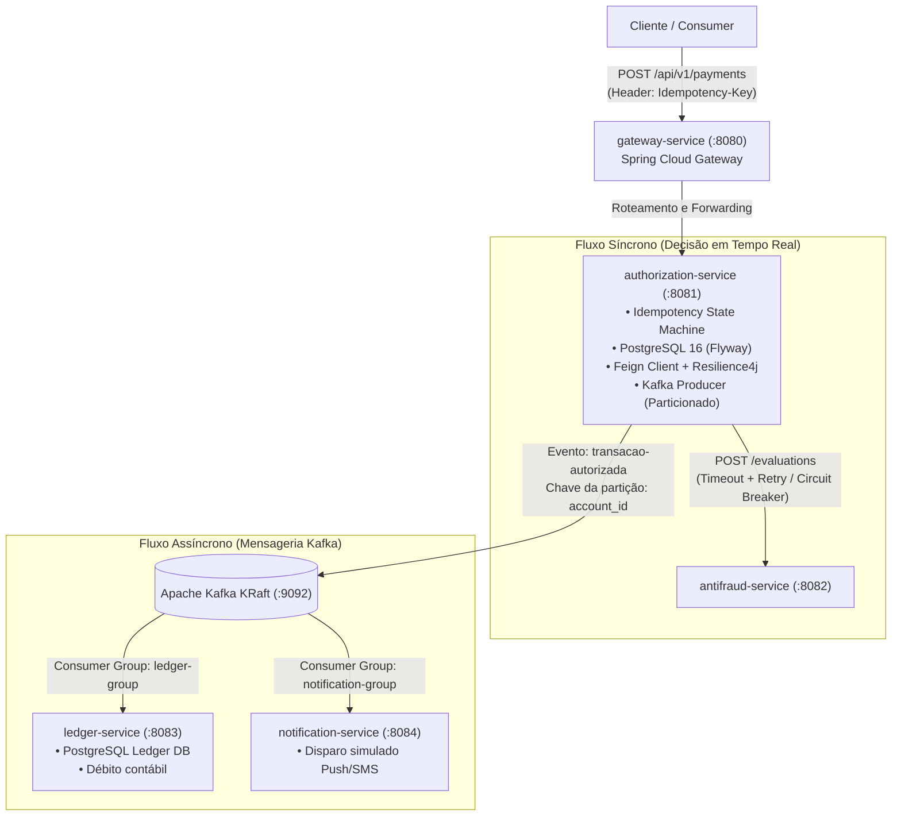

# Sistema de Autorização de Pagamentos com Antifraude e Mensageria Distribuída

<p align="center">
  
  
  
  
  
  
  
  
  
</p>

Plataforma distribuída de autorização de pagamentos financeiros de alta resiliência, com garantia estrita de **Idempotência**, **Tolerância a Falhas com Circuit Breaker (Resilience4j)**, **Mensageria com Apache Kafka**, **Contabilidade Distribuída (Ledger)** e **API Gateway Reativo** com documentação OpenAPI unificada.

---

## 🏛️ Arquitetura do Sistema — Fase 2 (Síncrona + Mensageria Kafka)



---

## 🚀 Como Executar

### Pré-requisitos
- Java 21 LTS
- Maven 3.9+ (ou utilizar `./mvnw`)
- Docker & Docker Compose

### Opção 1: Executando tudo via Docker Compose

```bash
docker compose up --build
```

Serviços iniciados:
- `postgres-auth`: PostgreSQL 16 para autorizações na porta `5432`
- `postgres-ledger`: PostgreSQL 16 para o ledger na porta `5433`
- `kafka`: Apache Kafka (KRaft mode) nas portas `9092` (interno) e `29092` (externo)
- `antifraud-service`: microsserviço de risco na porta `8082`
- `authorization-service`: microsserviço autorizador na porta `8081`
- `ledger-service`: microsserviço de livro razão contábil na porta `8083`
- `notification-service`: microsserviço de alertas na porta `8084`
- `gateway-service`: API Gateway unificado na porta `8080`

### Opção 2: Executando localmente via Maven

1. Suba os bancos de dados e o Kafka via Docker:
   ```bash
   docker compose up -d postgres-auth postgres-ledger kafka
   ```
2. Inicie os microsserviços em terminais separados:
   ```bash
   # Terminal 1: Antifraude
   cd antifraud-service && ./mvnw spring-boot:run

   # Terminal 2: Autorizador
   cd authorization-service && ./mvnw spring-boot:run

   # Terminal 3: Ledger
   cd ledger-service && ./mvnw spring-boot:run

   # Terminal 4: Notificação
   cd notification-service && ./mvnw spring-boot:run

   # Terminal 5: Gateway
   cd gateway-service && ./mvnw spring-boot:run
   ```

---

## 🧪 Suíte de Testes Automatizados

Para rodar todos os testes de todos os microsserviços do monorepo:

```bash
./mvnw test
```

### Cenários Cobertos nos Testes (28 testes automatizados):
- **Garantia de Idempotência:**
  - 1ª requisição: retorna `201 Created` e grava transação no banco.
  - Replays (2ª e 3ª chamadas): retornam `200 OK` com payload cacheado sem duplicar registros.
  - Concorrência imediata: retorna `409 Conflict` (`RFC 7807 ProblemDetail`).
- **Resiliência e Circuit Breaker:**
  - Queda/timeout no `antifraud-service` aciona fallback contingencial sem quebrar o autorizador (`500`).
  - Valores $\le$ R$ 500,00 aprovados em contingência; $>$ R$ 500,00 rejeitados preventivamente.
- **Mensageria com Apache Kafka (Fase 2):**
  - Publicação de evento `PaymentAuthorizedEvent` particionado por `account_id`.
  - Consumo independente no `ledger-service` (`ledger-group`): débito de saldo da conta e registro no livro razão contábil (`OperationType.DEBIT`).
  - Consumo independente no `notification-service` (`notification-group`): envio simulado de push/SMS com log auditável.
- **Gateway:**
  - Registro e resolução de rotas para pagamentos, antifraude, contas e documentação agregada.

---

## 📡 Exemplos de Uso da API

### 1. Criar Conta Contábil (via Gateway :8080)

```bash
curl -X POST http://localhost:8080/api/v1/accounts \
  -H "Content-Type: application/json" \
  -d '{
    "id": "3fa85f64-5717-4562-b3fc-2c963f66afa6",
    "owner_name": "João da Silva",
    "balance": 500.00,
    "currency": "BRL"
  }'
```

**Resposta (HTTP 201 Created):**
```json
{
  "id": "3fa85f64-5717-4562-b3fc-2c963f66afa6",
  "owner_name": "João da Silva",
  "balance": 500.00,
  "currency": "BRL",
  "updated_at": "2026-09-07T16:00:00Z"
}
```

### 2. Autorizar Pagamento (via Gateway :8080)

```bash
curl -X POST http://localhost:8080/api/v1/payments \
  -H "Content-Type: application/json" \
  -H "Idempotency-Key: 8f3d1b2a-4c5e-49b8-a123-9c8e7b6a5d4f" \
  -d '{
    "account_id": "3fa85f64-5717-4562-b3fc-2c963f66afa6",
    "merchant_id": "7ca85f64-5717-4562-b3fc-2c963f66afb7",
    "amount": 100.00,
    "currency": "BRL",
    "payment_method": "CREDIT_CARD",
    "card_token": "tok_visa_1234_sandbox"
  }'
```

**Resposta (HTTP 201 Created):**
```json
{
  "payment_id": "9b1deb4d-3b7d-4bad-9bdd-2b0d7b3dcb6d",
  "status": "APPROVED",
  "authorization_code": "AUTH-4F9A1B2C",
  "amount": 100.00,
  "currency": "BRL",
  "created_at": "2026-09-07T16:05:00Z"
}
```

> **Efeito Assíncrono:** Ao ser aprovado, o evento `PaymentAuthorizedEvent` é publicado no Kafka. O `ledger-service` consome o evento e debita o saldo da conta de R$ 500,00 para R$ 400,00, e o `notification-service` registra o push/SMS de confirmação.

### 3. Consultar Saldo da Conta Atualizado (via Gateway :8080)

```bash
curl -X GET http://localhost:8080/api/v1/accounts/3fa85f64-5717-4562-b3fc-2c963f66afa6
```

**Resposta (HTTP 200 OK):**
```json
{
  "id": "3fa85f64-5717-4562-b3fc-2c963f66afa6",
  "owner_name": "João da Silva",
  "balance": 400.00,
  "currency": "BRL",
  "updated_at": "2026-09-07T16:05:01Z"
}
```

---

## 📚 Documentação Swagger / OpenAPI Centralizada

- **Gateway (Swagger UI Unificado):** `http://localhost:8080/swagger-ui.html`
  - Permite visualizar e testar interativamente as APIs selecionando a definição no topo:
    - `authorization-service` (`/authorization-service/v3/api/docs`)
    - `antifraud-service` (`/antifraud-service/v3/api/docs`)
    - `ledger-service` (`/ledger-service/v3/api/docs`)
- **Acesso direto aos microsserviços:**
  - Autorizador: `http://localhost:8081/swagger-ui.html`
  - Antifraude: `http://localhost:8082/swagger-ui.html`
  - Ledger: `http://localhost:8083/swagger-ui.html`
