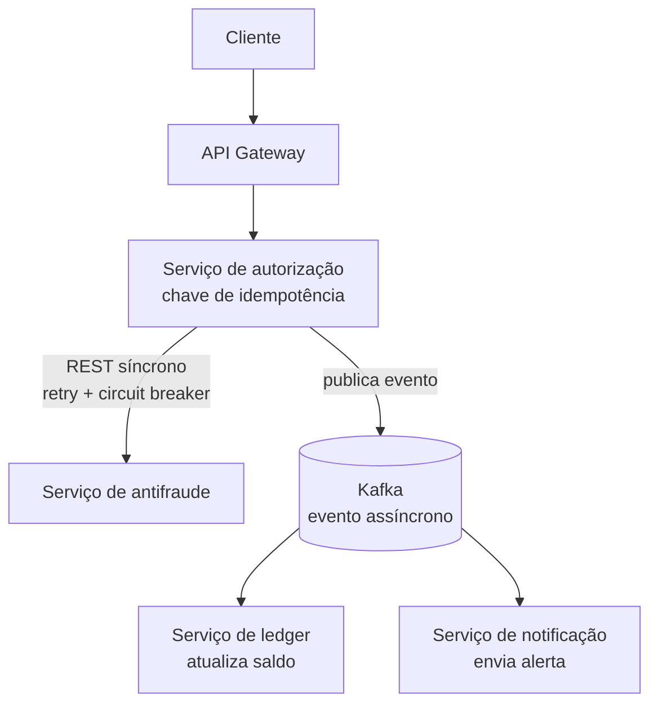

# PRD base — Sistema de autorização de pagamentos com antifraude

> Documento de apoio para geração de PRD. Projeto de portfólio: sistema de autorização de pagamentos com detecção de antifraude, estruturado como microsserviços dentro de um monorepo.

## Contexto e objetivo

Projeto de portfólio pensado para demonstrar, na prática, um conjunto de competências recorrentes em vagas de sistemas de pagamento/banking:

- Vivência com autorização, antifraude, pagamentos, banking e decisão em tempo real
- Idempotência, retries, timeouts, circuit breaker e consistência eventual
- Mensageria com Kafka
- Resiliência e confiabilidade em sistemas de missão crítica
- Observabilidade (OpenTelemetry + Grafana)
- Métricas de latência, throughput, taxa de erro e disponibilidade
- Uso documentado de IA generativa no fluxo de desenvolvimento

Desenvolvedor tem experiência prévia com Spring Boot, Spring Cloud Netflix (Eureka, Gateway, Feign, Resilience4j) e Flyway. Este é o primeiro projeto com mensageria (nunca implementou Kafka, RabbitMQ ou similar antes).

## Arquitetura



Fluxo: cliente chama o gateway, que encaminha ao serviço de autorização. Este consulta de forma síncrona o serviço de antifraude (com retry e circuit breaker via Resilience4j) e, com base na decisão, publica um evento no Kafka. O evento é consumido de forma assíncrona pelo serviço de ledger (atualização de saldo) e pelo serviço de notificação.

## Estrutura de pastas (monorepo)

```
payments-fraud-system/
├── gateway-service/
├── authorization-service/
├── antifraud-service/
├── ledger-service/
├── notification-service/
├── docker-compose.yml    # Kafka, Postgres, OTel Collector, Tempo, Prometheus, Grafana
├── docs/                 # diagramas de arquitetura por fase
└── README.md
```

Decisões de estrutura:
- Cada serviço é um projeto Spring Boot independente (pom.xml e Dockerfile próprios), sem parent pom compartilhado — reflete a filosofia de microsserviços independentemente deployáveis, mesmo dentro de um único repositório.
- Sem service discovery (Eureka) neste projeto: a rede do Docker Compose resolve os nomes dos serviços via DNS, o que já cobre a necessidade em ambiente local/portfólio.
- Observabilidade via OpenTelemetry + Grafana (sem Dynatrace): OTel Collector recebendo instrumentação de todos os serviços, exportando traces para o Grafana Tempo e métricas para o Prometheus, visualizados no Grafana.

## Roteiro por fases

1. **Núcleo síncrono do domínio** — Gateway + serviço de autorização + serviço de antifraude, comunicando via REST/Feign, com Resilience4j (retry, timeout, circuit breaker) e endpoint de autorização com header `Idempotency-Key`. Sem mensageria ainda.

2. **Primeiro contato com Kafka** — Um tópico (ex.: `transacao-autorizada`), serviço de autorização como producer, ledger e notificação como consumers básicos. Foco em internalizar produce/consume e entender a entrega at-least-once — sem outbox, sem DLQ ainda.

3. **Padrão outbox e reprocessamento** — Padrão Outbox para garantir que o evento publicado nunca fique dessincronizado do que foi persistido no banco. Fila de retry/dead-letter para falhas de consumo. É aqui que a consistência eventual fica concreta.

4. **Tracing e métricas com OpenTelemetry** — Instrumentação de todos os serviços com OpenTelemetry, exportando traces para o Grafana Tempo e métricas (Micrometer/Prometheus) para o Grafana. Dashboard no estilo RED method (rate, errors, duration) cobrindo latência, throughput, taxa de erro e disponibilidade.

5. **Teste de resiliência controlado** — Derrubar o container do serviço de antifraude e injetar latência artificial (Toxiproxy). Validar no Grafana que o circuit breaker abre e o fallback assume em vez do sistema cair. Opcional: gerar carga com k6 durante o teste.

6. **Fechando com IA generativa (opcional)** — Documentar onde IA generativa ajudou ao longo do projeto (geração de testes de carga, triagem de logs de erro, rascunho de documentação técnica).

## Formato de divulgação

Cada fase concluída gera um post no LinkedIn, seguindo o padrão já utilizado em projetos anteriores: o problema resolvido, o que surpreendeu durante a implementação, e link para o commit/tag correspondente.
