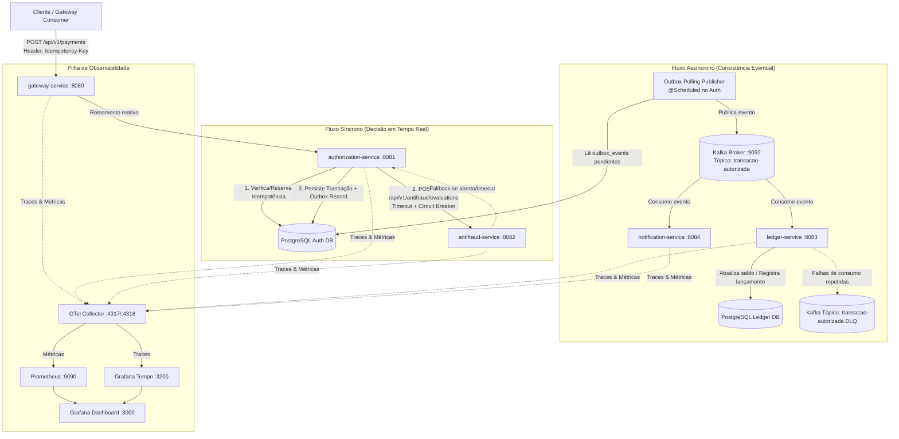

# PRD — Sistema de Autorização de Pagamentos com Antifraude

> **Versão:** V1.0  
> **Data:** 2026-09-05  
> **Autor:** Equipe de Engenharia / Portfólio  
> **Documentos Relacionados:** [Problem Framing](file:///C:/Users/guima/OneDrive/Documentos/projects/payments-authorization-system/docs/problem-framing-payments-authorization-system.md) \| [SRD](file:///C:/Users/guima/OneDrive/Documentos/projects/payments-authorization-system/docs/srd-payments-authorization-system.md) \| [PRD Base](file:///C:/Users/guima/OneDrive/Documentos/projects/payments-authorization-system/docs/prd-base-payments-authorization-system.md)

---

## 1. Histórico de Revisões

| Versão | Data | Autor | Descrição das Alterações |
|---|---|---|---|
| V1.0 | 2026-09-05 | Engenharia | Especificação completa detalhada das 5 fases de implementação técnica, remoção da fase de divulgação de IA, adição de checklists de progresso (`- [ ]`), contratos REST Nível 2, Outbox via Polling Publisher e cenários de teste de resiliência. |

---

## 2. Contexto e Motivação Técnica

Este projeto implementa uma plataforma de autorização de pagamentos distribuída de alto desempenho e tolerância a falhas. Projetado para simular o ecossistema de autorização e liquidação de instituições bancárias e fintechs, o sistema resolve desafios críticos da computação distribuída:
1. **Garantia de Idempotência:** Eliminação de cobranças duplicadas via chave única no header HTTP.
2. **Resiliência Síncrona:** Prevenção contra falhas em cascata no serviço de antifraude utilizando timeouts estritos, retries controlados e Circuit Breaker (Resilience4j).
3. **Consistência Eventual Segura:** Eliminação do problema de *dual-write* (banco vs mensageria) através do padrão *Transactional Outbox*, complementado por tratamento de falhas em consumidores com Dead Letter Queue (DLQ).
4. **Observabilidade de Missão Crítica:** Rastreabilidade distribuída completa (OpenTelemetry + Grafana Tempo) e métricas operacionais pelo método RED (Rate, Errors, Duration) com Prometheus e Grafana.

---

## 3. Visão Geral da Arquitetura e Monorepo

### 3.1 Diagrama de Arquitetura



### 3.2 Estrutura do Monorepo

```
payments-fraud-system/
├── gateway-service/          # Spring Cloud Gateway (Roteamento + DNS Docker)
├── authorization-service/    # Núcleo de autorização, Idempotency, Outbox Publisher
├── antifraud-service/        # Motor de análise de risco e simulação de latência
├── ledger-service/           # Livro razão contábil e gestão de saldos
├── notification-service/     # Consumidor de alertas e envio simulado
├── docker-compose.yml        # PostgreSQL, Kafka, OTel Collector, Tempo, Prometheus, Grafana, Toxiproxy
├── docs/                     # Especificações e diagramas arquiteturais
└── README.md                 # Guia de execução e operação do sistema
```

---

## 4. Checklist Geral de Execução do Projeto

Utilize este checklist para acompanhar e marcar o avanço das 5 fases de implementação:

- [x] **Fase 1: Núcleo Síncrono do Domínio** (Gateway, Autorizador, Antifraude, Idempotência e Resilience4j)
- [ ] **Fase 2: Primeiro Contato com Kafka** (Producer direto no Autorizador, Consumers no Ledger e Notificação)
- [ ] **Fase 3: Transactional Outbox e Reprocessamento** (Outbox Polling, Idempotência de Consumo e DLQ)
- [ ] **Fase 4: Observabilidade com OpenTelemetry** (OTel Collector, Tempo, Prometheus e Dashboard RED no Grafana)
- [ ] **Fase 5: Testes de Resiliência & Caos** (Injeção de falhas com Toxiproxy, validação de Circuit Breaker e k6)

---

## 5. Detalhamento Técnico das Fases

---

### 5.1 FASE 1: Núcleo Síncrono do Domínio

#### 🎯 Objetivo da Fase
Estabelecer o fluxo síncrono ponta a ponta entre `gateway-service`, `authorization-service` e `antifraud-service` via REST/OpenFeign, garantindo idempotência com chave no header e proteção de falhas do antifraude com Resilience4j (Timeout, Retry e Circuit Breaker).

#### 📋 Checklist de Tarefas da Fase 1
- [x] Configurar o projeto base e o `docker-compose.yml` inicial (PostgreSQL para `authorization-service`).
- [x] Criar o microsserviço `antifraud-service` (Spring Boot 3, Spring Web, SpringDoc OpenAPI).
  - [x] Implementar endpoint `POST /api/v1/antifraud/evaluations`.
  - [x] Implementar regra determinística de avaliação de risco:
    - Valor > R$ 5.000,00 ou flag `suspicious = true` $\rightarrow$ `REJECTED` (score: 95).
    - Valor $\le$ R$ 5.000,00 $\rightarrow$ `APPROVED` (score: 15).
  - [x] Adicionar header opcional `X-Simulate-Delay-Ms` para simular latência customizada de resposta.
- [x] Criar o microsserviço `authorization-service` (Spring Boot 3, Spring Data JPA, Flyway, PostgreSQL, OpenFeign, Resilience4j).
  - [x] Criar migrations Flyway para as tabelas `idempotency_records` e `transactions`.
  - [x] Criar filtro/interceptor ou Service para validação do header `Idempotency-Key`:
    - Se a chave não existir $\rightarrow$ grava registro com status `PROCESSING`.
    - Se a chave já existir com status `PROCESSING` $\rightarrow$ retorna `409 Conflict`.
    - Se a chave já existir com status `COMPLETED` $\rightarrow$ retorna `200 OK` com o payload de resposta cacheado salvo em `response_body`.
  - [x] Implementar cliente Feign para o `antifraud-service` com Resilience4j:
    - Timeout de 800ms.
    - Retry de 2 tentativas com backoff.
    - Circuit Breaker com fallback: quando o circuito abre ou dá timeout, aciona fallback contingencial (ex: autorizações abaixo de R$ 500 aprovadas em contingência, acima são rejeitadas preventivamente).
  - [x] Implementar endpoint `POST /api/v1/payments` seguindo as convenções de API e Bean Validation.
- [x] Criar o microsserviço `gateway-service` (Spring Cloud Gateway reativo).
  - [x] Configurar rotas para encaminhar `/api/v1/payments/**` para `authorization-service:8081`.
  - [x] Configurar repasse de headers, incluindo `Idempotency-Key`.
- [x] Escrever testes unitários e de integração (com Testcontainers PostgreSQL) para validação da idempotência e do fallback do circuit breaker.

#### 📦 Contratos de API da Fase 1

##### 1. Endpoint de Autorização de Pagamento (Gateway / Autorizador)
* **URI:** `POST /api/v1/payments`
* **Headers Obrigatórios:**
  * `Idempotency-Key`: UUID (ex: `8f3d1b2a-4c5e-49b8-a123-9c8e7b6a5d4f`)
  * `Content-Type`: `application/json`

**Payload de Requisição (`PaymentAuthorizationRequestDto`):**
```json
{
  "account_id": "3fa85f64-5717-4562-b3fc-2c963f66afa6",
  "merchant_id": "7ca85f64-5717-4562-b3fc-2c963f66afb7",
  "amount": 250.00,
  "currency": "BRL",
  "payment_method": "CREDIT_CARD",
  "card_token": "tok_visa_1234_sandbox"
}
```

**Payload de Resposta de Sucesso (`PaymentAuthorizationResponseDto` — HTTP `201 Created` ou `200 OK` no caso de replay idempotente):**
```json
{
  "payment_id": "9b1deb4d-3b7d-4bad-9bdd-2b0d7b3dcb6d",
  "status": "APPROVED",
  "authorization_code": "AUTH-892147",
  "amount": 250.00,
  "currency": "BRL",
  "created_at": "2026-09-05T19:30:00Z"
}
```

##### 2. Endpoint de Avaliação de Fraude (Antifraude)
* **URI:** `POST /api/v1/antifraud/evaluations`
* **Payload de Requisição (`AntifraudEvaluationRequestDto`):**
```json
{
  "account_id": "3fa85f64-5717-4562-b3fc-2c963f66afa6",
  "amount": 250.00,
  "payment_method": "CREDIT_CARD"
}
```
* **Payload de Resposta (`AntifraudEvaluationResponseDto` — HTTP `200 OK`):**
```json
{
  "evaluation_id": "5fa85f64-5717-4562-b3fc-2c963f66afe1",
  "recommendation": "APPROVED",
  "risk_score": 12,
  "evaluated_at": "2026-09-05T19:30:00.120Z"
}
```

#### 🛡️ Critérios de Aceitação da Fase 1
- [ ] Enviar a mesma requisição com a mesma `Idempotency-Key` três vezes consecutivas: a 1ª chamada retorna `201 Created`; a 2ª e 3ª chamadas retornam `200 OK` com o exato mesmo corpo da resposta sem gerar novas linhas na tabela `transactions`.
- [ ] Enviar requisição concorrente imediata com a mesma chave: a chamada concorrente retorna `409 Conflict` informando processamento em andamento.
- [ ] Parar o container do `antifraud-service`: chamadas para `/api/v1/payments` continuam respondendo via fallback do Circuit Breaker sem estourar `500 Internal Server Error`.

---

### 5.2 FASE 2: Primeiro Contato com Kafka

#### 🎯 Objetivo da Fase
Integrar o Apache Kafka na infraestrutura do Docker Compose e implementar a mensageria assíncrona básica: o `authorization-service` atua como Producer publicando eventos de transações autorizadas, enquanto `ledger-service` e `notification-service` atuam como Consumers básicos com semântica *at-least-once*.

#### 📋 Checklist de Tarefas da Fase 2
- [ ] Adicionar Apache Kafka (modo KRaft ou Zookeeper) no `docker-compose.yml`.
- [ ] Criar o tópico `transacao-autorizada` (3 partições, fator de replicação 1 para ambiente local).
- [ ] Configurar Spring Kafka Producer no `authorization-service`:
  - [ ] Publicar evento `PaymentAuthorizedEvent` logo após a gravação da transação no banco.
  - [ ] Utilizar `account_id` como chave de partição do Kafka (garantindo ordenação por conta).
- [ ] Criar o microsserviço `ledger-service` (Spring Boot 3, Spring Data JPA, PostgreSQL, Spring Kafka Consumer):
  - [ ] Criar migration Flyway para a tabela `accounts` e `ledger_entries`.
  - [ ] Configurar `@KafkaListener` no tópico `transacao-autorizada` (Consumer Group: `ledger-group`).
  - [ ] Ao receber o evento, debitar o valor do saldo da conta e criar um registro contábil de débito.
- [ ] Criar o microsserviço `notification-service` (Spring Boot 3, Spring Kafka Consumer):
  - [ ] Configurar `@KafkaListener` no tópico `transacao-autorizada` (Consumer Group: `notification-group`).
  - [ ] Ao receber o evento, gerar log formatado simulando o envio de push/SMS para o cliente.
- [ ] Testar a entrega ponta a ponta: pagamento submetido no Gateway $\rightarrow$ autorizado $\rightarrow$ saldo atualizado no Ledger e alerta logado no Notification.

#### 📦 Esquema do Evento Kafka (`transacao-autorizada`)
```json
{
  "event_id": "c1a85f64-5717-4562-b3fc-2c963f66afc2",
  "event_type": "PAYMENT_AUTHORIZED",
  "payment_id": "9b1deb4d-3b7d-4bad-9bdd-2b0d7b3dcb6d",
  "account_id": "3fa85f64-5717-4562-b3fc-2c963f66afa6",
  "merchant_id": "7ca85f64-5717-4562-b3fc-2c963f66afb7",
  "amount": 250.00,
  "currency": "BRL",
  "timestamp": "2026-09-05T19:30:00.250Z"
}
```

#### 🛡️ Critérios de Aceitação da Fase 2
- [ ] Disparar uma autorização de R$ 100 para uma conta com saldo de R$ 500: verificar que o `ledger-service` atualiza o saldo para R$ 400.
- [ ] Verificar que ambos os serviços (`ledger-service` e `notification-service`) processam a mensagem de forma independente usando grupos de consumidores distintos.
- [ ] Desligar o container do `notification-service`, autorizar pagamentos e ligá-lo novamente: validar que as mensagens acumuladas no Kafka são consumidas sem perda.

---

### 5.3 FASE 3: Transactional Outbox e Reprocessamento

#### 🎯 Objetivo da Fase
Resolver o problema do *dual-write* implementando o padrão **Transactional Outbox via Polling Publisher** no `authorization-service`, além de garantir resiliência aos consumidores no `ledger-service` com idempotência de consumo e redirecionamento de falhas para Dead Letter Queue (DLQ).

#### 📋 Checklist de Tarefas da Fase 3
- [ ] No `authorization-service`:
  - [ ] Criar migration Flyway para a tabela `outbox_events` (`id`, `aggregate_type`, `aggregate_id`, `type`, `payload`, `status`, `retry_count`, `created_at`).
  - [ ] Refatorar o fluxo de autorização: a gravação da transação e a inserção na `outbox_events` (com `status = 'PENDING'`) ocorrem na mesma anotação `@Transactional`. O envio direto ao Kafka durante a requisição HTTP é removido.
  - [ ] Criar o componente `@Scheduled` `OutboxPollingPublisher`:
    - Execução a cada 1 segundo (configurável).
    - Query com lock pessimista seguro: `SELECT * FROM outbox_events WHERE status = 'PENDING' ORDER BY created_at ASC LIMIT 50 FOR UPDATE SKIP LOCKED`.
    - Publica no Kafka e, com confirmação do ACK, atualiza o status para `SENT`.
    - Em caso de falha de publicação, incrementa `retry_count` e registra erro.
- [ ] No `ledger-service`:
  - [ ] Criar migration Flyway para a tabela `processed_events` (`event_id`, `processed_at`).
  - [ ] Implementar verificação de idempotência no consumidor: se `event_id` já existir na tabela, a mensagem é ignorada e comitada.
  - [ ] Configurar `DefaultErrorHandler` no Spring Kafka com backoff exponencial (3 tentativas com intervalo de 1s, 2s, 4s).
  - [ ] Configurar publicação automática no tópico `transacao-autorizada.DLQ` caso todas as tentativas de reprocessamento falhem.
- [ ] Criar cenário de teste para simular falha no banco do ledger e comprovar que a mensagem vai para a DLQ sem travar a partição principal.

#### 📦 Estrutura da Tabela Outbox (`authorization-service`)
```sql
CREATE TABLE outbox_events (
    id UUID PRIMARY KEY DEFAULT gen_random_uuid(),
    aggregate_type VARCHAR(50) NOT NULL,
    aggregate_id VARCHAR(100) NOT NULL,
    type VARCHAR(100) NOT NULL,
    payload JSONB NOT NULL,
    status VARCHAR(20) NOT NULL DEFAULT 'PENDING',
    retry_count INT NOT NULL DEFAULT 0,
    created_at TIMESTAMP WITH TIME ZONE DEFAULT CURRENT_TIMESTAMP,
    processed_at TIMESTAMP WITH TIME ZONE
);

CREATE INDEX idx_outbox_status_created ON outbox_events(status, created_at);
```

#### 🛡️ Critérios de Aceitação da Fase 3
- [ ] Parar o container do Kafka e submeter 5 pagamentos no autorizador: as autorizações devem ser salvas no Postgres com `status = 'PENDING'` no outbox e a API deve responder com sucesso (`201 Created`).
- [ ] Subir o Kafka novamente: o scheduler do Outbox deve processar todas as 5 mensagens pendentes, publicá-las e marcar o status como `SENT`.
- [ ] Simular um erro irrecuperável no `ledger-service` (ex: saldo insuficiente com regra estrita): a mensagem deve sofrer 3 tentativas com backoff e ser encaminhada para o tópico `transacao-autorizada.DLQ`.

---

### 5.4 FASE 4: Tracing e Métricas com OpenTelemetry

#### 🎯 Objetivo da Fase
Tornar o sistema completamente observável de ponta a ponta através de instrumentação com OpenTelemetry (OTel Collector, Grafana Tempo, Prometheus e Grafana), permitindo rastrear transações distribuídas e analisar métricas pelo método RED (Rate, Errors, Duration).

#### 📋 Checklist de Tarefas da Fase 4
- [ ] Adicionar ao `docker-compose.yml`:
  - [ ] OTel Collector (`otel/opentelemetry-collector-contrib`).
  - [ ] Grafana Tempo (Distributed Tracing).
  - [ ] Prometheus (Coleta de métricas via Micrometer / OTel).
  - [ ] Grafana com datasources e dashboards pré-provisionados via YAML.
- [ ] Instrumentar todos os microsserviços Spring Boot:
  - [ ] Adicionar dependências `micrometer-registry-prometheus` e `opentelemetry-spring-boot-starter` (ou Java Agent OpenTelemetry).
  - [ ] Configurar exportação de traces via OTLP (gRPC porta 4317 ou HTTP porta 4318).
  - [ ] Garantir propagação de contexto W3C (`traceparent`) nas chamadas REST via OpenFeign e nas mensagens do Apache Kafka via headers de registro.
- [ ] Criar métricas customizadas de negócio no `authorization-service`:
  - [ ] Contador de autorizações por status (`payments.authorized.count`, labels: `status`, `payment_method`).
  - [ ] Timer de latência de comunicação com o antifraude (`antifraud.evaluation.duration`).
  - [ ] Medidor de itens pendentes no outbox (`outbox.pending.gauge`).
- [ ] Montar Dashboard RED no Grafana com os 4 pilares:
  - **Rate:** Requisições por segundo (Throughput no Gateway e Autorizador).
  - **Errors:** Taxa de erro HTTP (4xx e 5xx) e contagem de mensagens na DLQ.
  - **Duration:** Gráficos de latência p50, p95 e p99.
  - **Tracing Search:** Painel integrado para clicar em um erro e visualizar o trace completo no Grafana Tempo (Gateway $\rightarrow$ Auth $\rightarrow$ Antifraud $\rightarrow$ Kafka $\rightarrow$ Ledger).

#### 🛡️ Critérios de Aceitação da Fase 4
- [ ] Executar uma requisição de pagamento via Gateway e localizar o `trace_id` correspondente no Grafana Tempo: verificar spans do Gateway, Auth, chamada Feign do Antifraude e consumo no Ledger.
- [ ] Submeter chamadas inválidas e checar no Grafana se a taxa de erro HTTP 400 é refletida no gráfico do dashboard em menos de 15 segundos.

---

### 5.5 FASE 5: Teste de Resiliência Controlado

#### 🎯 Objetivo da Fase
Validar experimentalmente a robustez da arquitetura de microsserviços injetando falhas controladas com Toxiproxy e gerando carga concorrente com k6, comprovando na prática a abertura do Circuit Breaker, a execução do fallback e a preservação do sistema sem efeito cascata.

#### 📋 Checklist de Tarefas da Fase 5
- [ ] Adicionar o **Toxiproxy** ao `docker-compose.yml` intermediando a comunicação entre `authorization-service` e `antifraud-service`.
- [ ] Criar scripts de teste de carga com **k6**:
  - [ ] `k6-baseline.js`: 50 usuários virtuais (VUs) constantes gerando requisições com chaves de idempotência únicas por 2 minutos.
  - [ ] `k6-idempotency-stress.js`: 100 VUs disparando a mesma chave de idempotência repetidamente para validar resistência à concorrência.
- [ ] Executar cenários de caos com Toxiproxy:
  - [ ] **Cenário A (Latência Artificial):** Injetar 2.000ms de latência no proxy do Antifraude:
    - O Feign deve estourar timeout aos 800ms.
    - O Circuit Breaker deve abrir após atingir a taxa limite de falhas.
    - As requisições subsequentes devem acionar o fallback imediatamente (< 5ms) sem chamar o antifraude.
  - [ ] **Cenário B (Queda Total do Container):** Parar o container do `antifraud-service` durante a execução do teste k6:
    - O sistema deve permanecer operacional (disponibilidade 100%), registrando os pagamentos contingenciais.
- [ ] Documentar os resultados comparativos de latência e throughput no relatório de testes.

#### 🛡️ Critérios de Aceitação da Fase 5
- [ ] Sob injeção de 2s de latência no antifraude, a latência média geral do autorizador (medida pelo k6) deve cair drasticamente após o Circuit Breaker abrir (passando de 800ms para < 20ms).
- [ ] 0 requisições resultam em `500 Internal Server Error` durante o teste de caos com o antifraude offline.

---

## 6. Contratos de API e Padrão de Erro

Seguindo as diretrizes de [api-conventions](file:///C:/Users/guima/OneDrive/Documentos/projects/payments-authorization-system/.agents/skills/api-conventions/SKILL.md) e [exception-handling-conventions](file:///C:/Users/guima/OneDrive/Documentos/projects/payments-authorization-system/.agents/skills/exception-handling-conventions/SKILL.md):
* **Maturidade de Richardson:** Nível 2 estrito (URIs no plural, verbos corretos, sem HATEOAS).
* **Documentação OpenAPI:** Todas as rotas e DTOs documentados com anotações `@Tag`, `@Operation`, `@ApiResponses`, `@Parameter` e `@Schema`.
* **Formato de Erro:** Padrão RFC 7807 / RFC 9457 (`ProblemDetail`) nativo do Spring Boot 3 sem exposição de stack traces.

### 6.1 Catálogo de Códigos de Retorno HTTP

| Código HTTP | Cenário | Resposta / Body |
|---|---|---|
| `201 Created` | Pagamento processado e autorizado com sucesso pela primeira vez. | `PaymentAuthorizationResponseDto` |
| `200 OK` | Replay idempotente (mesma `Idempotency-Key` reenviada após conclusão). | `PaymentAuthorizationResponseDto` original |
| `400 Bad Request` | Falha de validação Bean Validation (campos obrigatórios nulos ou inválidos). | `ProblemDetail` com mapa de erros de campos |
| `409 Conflict` | Requisição concorrente com a mesma `Idempotency-Key` ainda em processamento. | `ProblemDetail` (`urn:problem-type:conflict`) |
| `422 Unprocessable Content` | Violação de regra de negócio (ex: conta inativa, saldo inválido). | `ProblemDetail` (`urn:problem-type:business-rule-violation`) |
| `500 Internal Server Error` | Falha sistêmica inesperada tratada pelo `@RestControllerAdvice`. | `ProblemDetail` genérico sanitizado |

---

## 7. Modelagem de Dados Consolidada (PostgreSQL)

### 7.1 Banco de Dados do `authorization-service`

```sql
-- Controle estrito de Idempotência
CREATE TABLE idempotency_records (
    idempotency_key VARCHAR(100) PRIMARY KEY,
    status VARCHAR(20) NOT NULL, -- 'PROCESSING', 'COMPLETED', 'FAILED'
    response_body JSONB,
    http_status INT,
    created_at TIMESTAMP WITH TIME ZONE DEFAULT CURRENT_TIMESTAMP,
    updated_at TIMESTAMP WITH TIME ZONE DEFAULT CURRENT_TIMESTAMP
);

-- Registro da Transação Financeira
CREATE TABLE transactions (
    id UUID PRIMARY KEY DEFAULT gen_random_uuid(),
    account_id UUID NOT NULL,
    merchant_id UUID NOT NULL,
    amount NUMERIC(15, 2) NOT NULL,
    currency VARCHAR(3) NOT NULL DEFAULT 'BRL',
    payment_method VARCHAR(30) NOT NULL,
    status VARCHAR(20) NOT NULL, -- 'APPROVED', 'REJECTED', 'FAILED'
    authorization_code VARCHAR(50),
    antifraud_score INT,
    created_at TIMESTAMP WITH TIME ZONE DEFAULT CURRENT_TIMESTAMP
);

CREATE INDEX idx_transactions_account ON transactions(account_id);
```

### 7.2 Banco de Dados do `ledger-service`

```sql
-- Tabela de Contas
CREATE TABLE accounts (
    id UUID PRIMARY KEY,
    owner_name VARCHAR(150) NOT NULL,
    balance NUMERIC(15, 2) NOT NULL DEFAULT 0.00,
    currency VARCHAR(3) NOT NULL DEFAULT 'BRL',
    updated_at TIMESTAMP WITH TIME ZONE DEFAULT CURRENT_TIMESTAMP
);

-- Livro Razão (Ledger Entries)
CREATE TABLE ledger_entries (
    id UUID PRIMARY KEY DEFAULT gen_random_uuid(),
    account_id UUID NOT NULL REFERENCES accounts(id),
    payment_id UUID NOT NULL,
    operation_type VARCHAR(20) NOT NULL, -- 'DEBIT', 'CREDIT'
    amount NUMERIC(15, 2) NOT NULL,
    created_at TIMESTAMP WITH TIME ZONE DEFAULT CURRENT_TIMESTAMP
);

-- Idempotência do Consumidor Kafka
CREATE TABLE processed_events (
    event_id UUID PRIMARY KEY,
    processed_at TIMESTAMP WITH TIME ZONE DEFAULT CURRENT_TIMESTAMP
);
```

---

## 8. Requisitos Não Funcionais e Segurança

* **Performance:** Latência síncrona p95 no autorizador $\le$ 200ms em tráfego nominal.
* **Tolerância a Falhas:** Isolamento de threads entre chamadas síncronas ao antifraude via Resilience4j; o autorizador nunca deve demorar mais de 800ms para responder em caso de indisponibilidade do parceiro.
* **Idempotência Concorrente:** Bloqueio transacional de nível de isolamento adequado (`READ COMMITTED` com trava de chave única) para evitar condição de corrida em requisições simultâneas com a mesma chave.
* **Segurança de Dados:** Dados sensíveis de cartão (CVV e número completo) nunca devem ser trafegados ou gravados em banco ou logs (utilizar tokens mockados).
