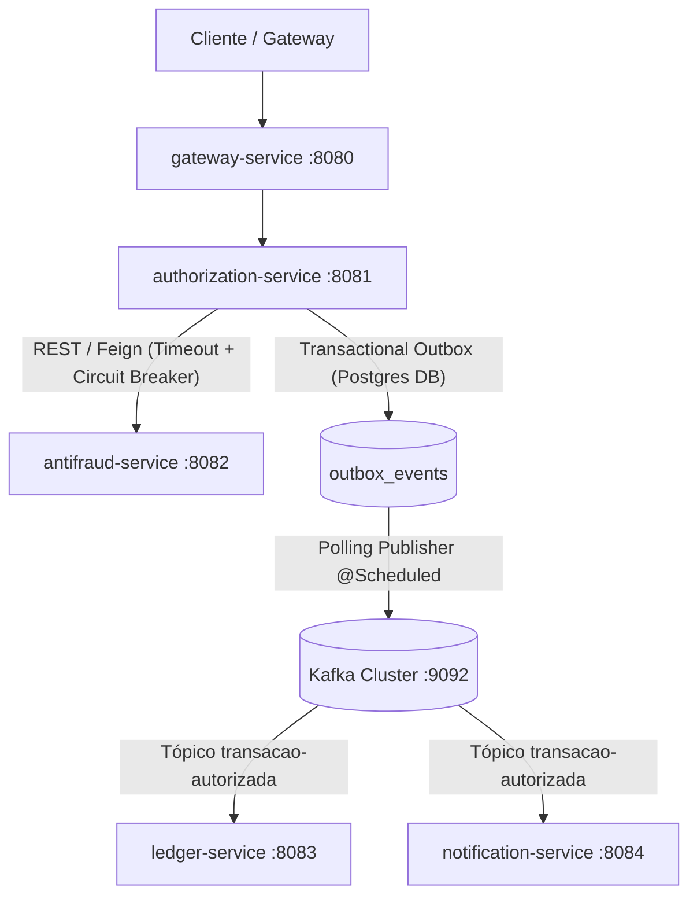

# SRD — Sistema de Autorização de Pagamentos com Antifraude

> Versão: V1.0  
> Data: 2026-09-05  
> Autor: Equipe de Engenharia / Portfólio  
> Documento Relacionado: [Problem Framing](file:///C:/Users/guima/OneDrive/Documentos/projects/payments-authorization-system/docs/problem-framing-payments-authorization-system.md)

---

## 1. Customer

* **Clientes Externos / Aplicações Integradoras:** Gateways de pagamento, plataformas de e-commerce e apps financeiros que realizam requisições de autorização via HTTP/REST.
* **Usuários Finais (Pagadores/Recebedores):** Titulares de contas bancárias e cartões que necessitam de transações seguras, com feedback em tempo real e sem risco de débitos em duplicidade.
* **Engenharia e Operações:** Engenheiros de software e avaliadores técnicos que analisam a arquitetura distribuída, resiliência sob falhas, tolerância a partições e consistência eventual.

## 2. Job to be Done

Quando uma transação de pagamento é submetida, o sistema deve processar a intenção em tempo real com garantia de idempotência, consultar o motor de antifraude de forma síncrona e resiliente (com retries e circuit breaker) e persistir a decisão garantindo a publicação assíncrona do evento no Kafka (sem perda de dados) para que o saldo contábil (*ledger*) seja atualizado e o cliente notificado.

## 3. Benefit

### 3.1 Valor e Benefícios para o Cliente
* **Experiência sem atrito:** Resposta imediata de autorização (`APPROVED` ou `REJECTED`) com latência p95 < 200ms.
* **Proteção contra cobrança indevida:** Garantia de idempotência absoluta — reenvios acidentais ou retries de rede devolvem o resultado original sem duplicar o lançamento financeiro.
* **Notificação tempestiva:** Recebimento desacoplado de alertas de confirmação ou rejeição.

### 3.2 Valor e Benefícios para o Negócio
* **Confiabilidade e Integridade Contábil:** Eliminação do problema de *dual-write* através do padrão Transactional Outbox (nenhum evento publicado no Kafka sem commit prévio no banco de dados).
* **Alta Disponibilidade e Não Cascata:** O sistema continua operando e aplicando regras de contingência (fallback) mesmo quando o serviço de antifraude sofre latência excessiva ou cai.
* **Observabilidade Operacional:** Monitoramento unificado através do método RED (Rate, Errors, Duration), permitindo rápida detecção de anomalias e cumprimento de SLAs.

### 3.3 Impacto de Marca e Portfólio
* Demonstração prática e comprovada de competências sênior em arquitetura de microsserviços para o setor bancário/pagamentos: Spring Boot 3, Kafka, Docker Compose, Resilience4j e OpenTelemetry.

## 4. Problem

Em ecossistemas de pagamentos e banking, falhas operacionais e inconsistências distribuídas causam danos graves:
1. **Cobranças Duplicadas por Falta de Idempotência:** Conexões instáveis de internet levam clientes e gateways a reenviar requisições de pagamento. Sem controle de chave de idempotência com travas adequadas, transações idênticas são processadas mais de uma vez.
2. **Efeito Cascata por Falha de Dependências:** O serviço de antifraude é uma dependência síncrona crítica. Se ele apresentar alta latência ou indisponibilidade, chamadas REST bloqueantes acumulam threads, esgotam o pool de conexões e derrubam o serviço de autorização por completo.
3. **Inconsistência Relacional x Mensageria (*Dual-Write*):** Se o serviço persistir o pagamento no banco e falhar ao publicar no Kafka, a autorização existe, mas o saldo no *ledger* nunca é atualizado e o cliente não recebe notificação. Se publicar antes de commitar e o banco falhar, o evento é consumido indevidamente.
4. **Falta de Rastreabilidade Distribuída:** Quando uma transação falha ou demora, a ausência de rastreamento distribuído (Trace ID / Span ID) impede identificar se o atraso ocorreu no Gateway, no Autorizador, no Antifraude ou na fila de mensageria.

## 5. Solution

Arquitetura de microsserviços distribuídos em monorepo, desenvolvidos com Spring Boot 3 e orquestrados localmente via Docker Compose.

### 5.1 Benchmark Analysis (Análise de Mercado)
* **Padrões de Mercado Financeiro (Stripe, Adyen, Nubank):** Uso mandatório do cabeçalho `Idempotency-Key` no padrão UUIDv4, persistido em base de dados com estados transitórios (`PROCESSING`) e finalizados (`COMPLETED`).
* **Resiliência Síncrona:** Uso de Circuit Breaker com Resilience4j para isolar falhas de serviços externos de pontuação de crédito/fraude, redirecionando para regras de contingência (fallback determinístico).
* **Consistência Distribuída:** Adoção do *Transactional Outbox Pattern* para garantir semântica *at-least-once* sem risco de inconsistência entre SQL e Kafka.

### 5.2 Before/After Comparison (Comparativo Antes / Depois)

| Dimensão | Estado Sem a Solução (Cenário Frágil) | Estado com a Solução (Cenário Resiliente) |
|---|---|---|
| **Retries do Cliente** | Risco de múltiplas cobranças para a mesma intenção de compra. | Resposta idêntica cacheada retornada imediatamente (`200 OK`) com a mesma chave. |
| **Queda do Antifraude** | Travamento de threads, timeouts de 30s e queda do serviço de autorização. | Timeout rápido (500ms), abertura de circuito via Circuit Breaker e acionamento de fallback seguro. |
| **Publicação de Eventos** | Falha de rede com o broker causa perda permanente da mensagem após commit local. | Transação do banco e evento gravados atomicamente via Outbox; reprocessamento garantido via Polling. |
| **Consumo e Falhas** | Mensagens que falham travam a partição do Kafka ou são perdidas em commit cego. | Retries com backoff exponencial e direcionamento para Dead Letter Queue (DLQ). |
| **Diagnóstico** | Análise manual de logs isolados em múltiplos arquivos de texto. | Traces unificados no Grafana Tempo e métricas RED no Prometheus/Grafana. |

### 5.3 Scope (In / Out)

| In Scope (Escopo do Projeto) | Out of Scope (Fora do Escopo) |
|---|---|
| Gateway com roteamento reativo Spring Cloud Gateway | Service Discovery externo (Eureka/Consul) — nomes resolvidos via DNS Docker |
| Serviço de Autorização com persistência Postgres e Idempotency-Key | Implementação de HATEOAS nas APIs (Richardson Nível 2 estrito) |
| Serviço de Antifraude com análise e simulação de latência | Mecanismo Debezium CDC no início (adotado Polling Publisher mais simples) |
| Serviço de Ledger (livro razão contábil de contas/saldos) | Interface gráfica web/mobile (foco exclusivo em APIs backend) |
| Serviço de Notificação (consumo e log/mock de envio de alertas) | Gateway de pagamento externo real (Cielo, Stone, etc.) |
| Mensageria Kafka com tópicos dedicados, consumer groups e DLQ | Gestão de cartões com conformidade PCI-DSS completa (dados sensíveis mockados) |
| Observabilidade via OTel Collector, Tempo, Prometheus e Grafana | Fase 6 anterior de divulgação em LinkedIn/IA (removida do escopo técnico) |
| Injeção de falhas com Toxiproxy e testes de carga com k6 | Deploy em cloud pública AWS/GCP (foco em execução local reproduzível) |

### 5.4 Phasing (Planejamento das 5 Fases)

| Fase | Título | Objetivo Central | Entregáveis |
|---|---|---|---|
| **Fase 1** | **Núcleo Síncrono do Domínio** | Estabelecer o fluxo síncrono ponta a ponta com segurança e resiliência | `gateway-service`, `authorization-service`, `antifraud-service`, tabela de idempotência, Feign Client, Resilience4j (Retry, Timeout, Circuit Breaker). |
| **Fase 2** | **Primeiro Contato com Kafka** | Introduzir mensageria assíncrona básica | Tópico Kafka `transacao-autorizada`, autorizador como producer direto, `ledger-service` e `notification-service` como consumers básicos. |
| **Fase 3** | **Transactional Outbox & Reprocessamento** | Garantir consistência eventual absoluta e tolerância a falhas nos consumidores | Tabela `outbox_events`, Polling Publisher (`@Scheduled`), idempotência nos consumers, tópicos de retry e Dead Letter Queue (DLQ). |
| **Fase 4** | **Observabilidade com OpenTelemetry** | Tornar o sistema totalmente observável sob métricas RED e Tracing | Instrumentação OpenTelemetry em todos os serviços, OTel Collector, Grafana Tempo, Prometheus e Dashboard Grafana consolidado. |
| **Fase 5** | **Testes de Resiliência & Caos** | Validar experimentalmente a robustez da arquitetura sob estresse | Toxiproxy injetando latência e queda de container no Antifraude, validação do Circuit Breaker abrindo em tempo real e scripts k6. |

## 6. Success Metrics

| Tipo de Métrica | Nome da Métrica | Meta / Critério de Sucesso |
|---|---|---|
| **Métrica Central** | Taxa de Sucesso de Idempotência | 100% das requisições repetidas com mesma chave retornam o payload original sem criar novos registros. |
| **Métrica Central** | Latência de Autorização (p95) | ≤ 200 ms em condições normais de operação no fluxo síncrono. |
| **Métrica Central** | Integridade de Consistência Eventual | 0 eventos perdidos entre o banco do autorizador e os serviços consumidores (validado pelo Outbox). |
| **Observação** | Disponibilidade sob Falha do Antifraude | 100% das requisições continuam sendo respondidas (via fallback) quando o container do antifraude é derrubado. |
| **Observação** | Tempo de Abertura do Circuit Breaker | Circuito abre em ≤ 3 chamadas com falha consecutiva ou taxa > 50%, protegendo o pool de threads. |
| **Observação** | Cobertura de Rastreabilidade | 100% das requisições no Gateway propagam `traceparent` / `trace_id` até os consumidores Kafka. |

## 7. Risks & Mitigation

| Categoria | Descrição do Risco | Mitigação Arquitetural |
|---|---|---|
| **Técnico** | Latência excessiva ou timeout no serviço de Antifraude bloqueando o Autorizador. | Configuração rigorosa de timeout (máximo 800ms) no Feign/Resilience4j com Circuit Breaker configurado para abrir rápido e acionar fallback. |
| **Técnico** | Falha de publicação no Kafka após persistência no banco (*dual-write problem*). | Adoção do padrão Transactional Outbox: o evento é persistido na mesma transação ACID do pagamento no PostgreSQL e publicado assincronamente por scheduler dedicado. |
| **Técnico** | Processamento duplicado de eventos pelos consumidores Kafka (*at-least-once delivery*). | Implementação de tabela de controle de eventos processados (`processed_events`) nos microsserviços de Ledger e Notificação. |
| **Operacional** | Sobrecarga de containers no Docker Compose local esgotando memória da máquina. | Definição de limites estritos de memória (`deploy.resources.limits.memory`) no `docker-compose.yml` para Kafka, Postgres e serviços Java. |

## 8. Feedback Loops & Validação

### 8.1 Validação de Stakeholders
* Validação contínua do comportamento da API através da documentação interativa Swagger/OpenAPI em cada serviço (`/swagger-ui.html`).
* Logs estruturados com RFC 7807 (`ProblemDetail`) para comunicação clara de erros operacionais.

### 8.2 Estratégia de Testes
* Testes unitários e de integração com Spring Boot Test e Testcontainers (PostgreSQL e Kafka).
* Testes de carga controlados via k6 simulando requisições concorrentes com chaves de idempotência repetidas e inéditas.
* Testes de caos com Toxiproxy para comprovar a resiliência do Circuit Breaker.

### 8.3 Comparativo de Dados (Antes vs Depois)
* Validação via dashboard Grafana comparando throughput e taxa de erro antes e durante a injeção de falhas com Toxiproxy.

## 9. Product Requirements (Visão Consolidada)

1. O sistema deve expor um endpoint único no API Gateway (`/api/v1/payments`) que repassa as chamadas ao serviço de autorização.
2. Toda requisição de pagamento deve conter o header `Idempotency-Key` (UUIDv4 obrigatório).
3. O serviço de autorização deve persistir o status inicial, consultar o antifraude síncrono e tomar a decisão final.
4. O evento resultante deve ser despachado assincronamente com semântica de entrega garantida.
5. O serviço de ledger deve atualizar o saldo contábil da conta de forma idempotente.
6. O serviço de notificação deve emitir alertas simulados de sucesso ou recusa.
7. O sistema deve ser integralmente monitorado com OpenTelemetry e Grafana.

## 10. UI/UX Requirements (Developer Experience)

* Como o produto é puramente backend, o foco está na **Developer Experience (DX)** e na clareza dos contratos:
  * Documentação OpenAPI 3.0 rica com exemplos em todos os DTOs.
  * Erros padronizados via RFC 7807 (`ProblemDetail`).
  * Subida 100% automatizada de todas as dependências via um único comando `docker compose up -d`.
