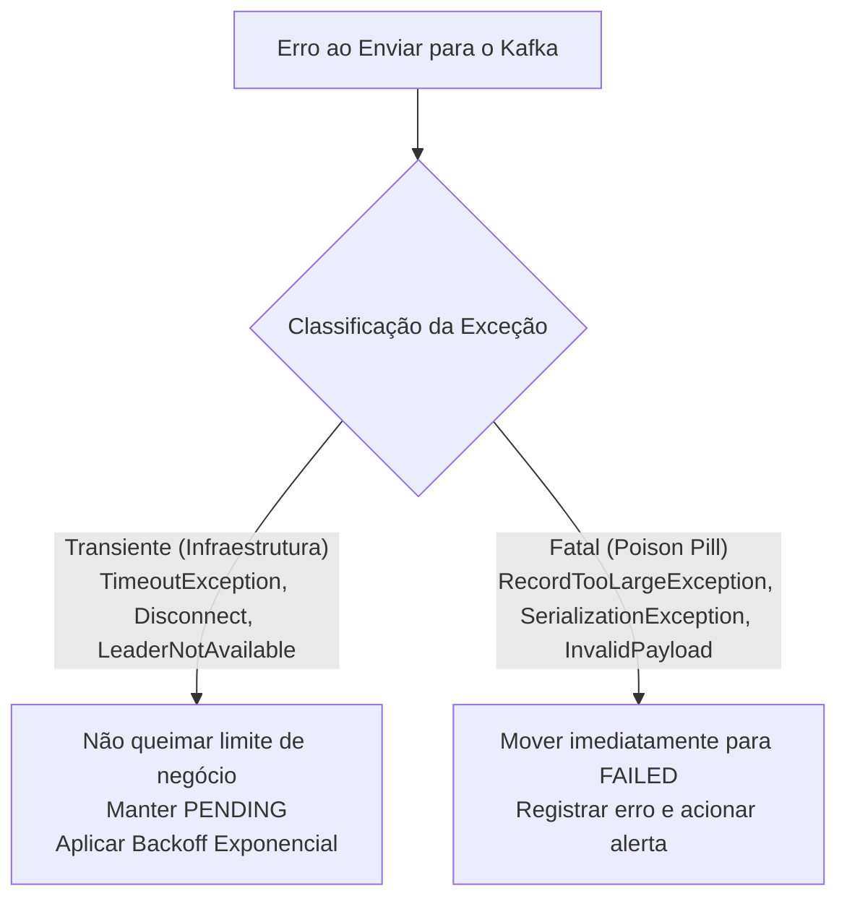
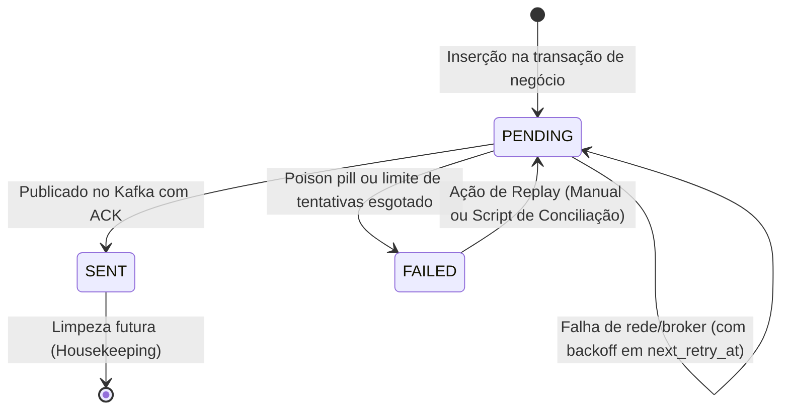

Em arquiteturas orientadas a eventos e sistemas de pagamentos, o problema que você simulou é um dos testes mais reveladores sobre a maturidade do **Transactional Outbox**.

Quando o broker Kafka fica fora do ar, o sistema enfrenta uma **falha de infraestrutura externa (transiente)**, e não um defeito intrínseco na mensagem (**poison pill**). Se a aplicação apenas incrementar o contador de tentativas a cada ciclo e mudar para `FAILED`, o Outbox "desiste" dos eventos no momento em que deveria protegê-los, quebrando a garantia de consistência eventual (*at-least-once delivery*).

Abaixo estão as práticas recomendadas e maduras para lidar com retries, falhas e resiliência nesse padrão.

---

### 1. Distinção entre Erro Transiente vs. Poison Pill

O primeiro passo é classificar os erros em duas categorias:



* **Erros Transientes (Falha de Broker/Rede):** `TimeoutException`, `DisconnectException`, `NetworkException`, indisponibilidade de réplicas. 
  * O evento está perfeitamente íntegro; o canal de envio é que está oscilando.
  * **Prática:** Não queime o teto de retries que levaria o registro a `FAILED`. O evento deve continuar como `PENDING`.
* **Erros Fatais / Não Recuperáveis (Poison Pill):** `RecordTooLargeException`, erro de serialização de esquema, violação de tipos, payload corrompido.
  * Reenviar esse registro mil vezes não resolverá o problema sem intervenção no código ou no broker.
  * **Prática:** Mova imediatamente (*fast-fail*) para `FAILED`, registre o motivo e não tente reenviá-lo no fluxo comum.

---

### 2. Backoff Exponencial com Jitter na Tabela (`next_retry_at`)

Manter apenas `retry_count` e reconsultar a cada segundo faz o poller martelar o banco de dados e o broker desnecessariamente.

A prática padrão é adicionar uma coluna temporal de agendamento na tabela:

```sql
ALTER TABLE outbox_events 
    ADD COLUMN next_retry_at TIMESTAMP WITH TIME ZONE,
    ADD COLUMN last_error_message TEXT;

-- Índice parcial atualizado para considerar o agendamento
DROP INDEX IF EXISTS idx_outbox_unpublished;
CREATE INDEX idx_outbox_unpublished
    ON outbox_events (created_at ASC)
    WHERE status = 'PENDING';
```

#### Como calcular o próximo agendamento:
Quando ocorre uma falha recuperável:
$$\text{delay} = \min(\text{max\_delay},\; \text{base\_delay} \times 2^{\text{retry\_count}}) \pm \text{jitter}$$

Onde o **jitter** (variação aleatória) impede que dezenas de mensagens agendadas acordem e disputem os mesmos recursos exatamente no mesmo milissegundo.

A query de busca do poller passa a considerar essa data:

```sql
SELECT * FROM outbox_events
WHERE status = 'PENDING'
  AND (next_retry_at IS NULL OR next_retry_at <= NOW())
ORDER BY created_at ASC
LIMIT :limit
FOR UPDATE SKIP LOCKED;
```

---

### 3. Circuit Breaker e Pausa no Agendador (Evitar *Retry Storm*)

Se você tem 1.000 mensagens pendentes e a primeira falhou por queda do Kafka, iterar sobre as outras 999 no mesmo segundo é inútil e consome conexões e ciclos de CPU.

Práticas maduras para interrupção de ciclo:
1. **Interrupção Imediata do Lote (*Fail-Fast*):** Ao detectar o primeiro erro de comunicação de broker no lote, interrompa o laço atual (`break`).
2. **Backoff no Agendador / Circuit Breaker:** Se o broker estiver inalcançável, pause as execuções do agendador por um período crescente (ex.: 5s, 15s, 30s) ou use um Circuit Breaker (como Resilience4j). O poller só volta a processar normalmente quando uma mensagem de teste (ou *ping*) tiver confirmação de entrega com sucesso.

---

### 4. O Ciclo de Vida dos Estados e o Papel do `FAILED`

Em um ambiente de alta maturidade, o estado `FAILED` não é um descarte silencioso; ele atua como uma **Dead Letter Table**.



Campos essenciais na tabela para investigação técnica:
* `retry_count`: Quantidade de tentativas realizadas.
* `next_retry_at`: Próximo momento permitido para nova tentativa.
* `last_error_message`: Motivo do último erro ou stacktrace resumido.
* `failed_at`: Momento em que o registro foi considerado irrecuperável automaticamente.

---

### 5. Observabilidade e Alertas Imediatos

Um registro no estado `FAILED` no outbox indica que um evento persistido pelo negócio **não foi propagado** para o restante do ecossistema. Isso gera divergência de dados entre serviços.

* **Alerta Crítico (PagerDuty / Slack / E-mail):** Qualquer evento que transite para `FAILED` (`count(status = 'FAILED') > 0`) deve disparar um alerta imediatamente para o time de suporte e engenharia.
* **Métrica de Idade do Backlog (*Lag*):**
  * Não monitore apenas a quantidade de mensagens em `PENDING`.
  * Monitore a **idade do evento pendente mais antigo**:
    $$\text{outbox\_oldest\_pending\_age\_seconds} = \text{NOW}() - \min(\text{created\_at})\; \text{para status = 'PENDING'}$$
  * Se houver itens em `PENDING` há mais de 5 ou 10 minutos, significa que a fila está travada ou o broker está fora.

---

### 6. Mecanismos de Replay e Conciliação (*Self-Healing*)

Para resolver eventos que caíram em `FAILED` sem precisar fazer alterações manuais via SQL no banco de produção:

1. **Endpoint Interno ou CLI de Replay:**
   Crie um ponto de controle seguro para reprocessamento:
   ```http
   POST /internal/outbox/replay
   Content-Type: application/json

   {
     "status": "FAILED",
     "limit": 100
   }
   ```
   A execução altera o status de volta para `PENDING`, redefine `retry_count = 0` e ajusta `next_retry_at = NOW()`.

2. **Garantia Obrigatória: Idempotência nos Consumidores:**
   Como a política do Outbox é de **entrega ao menos uma vez** (*at-least-once delivery*), uma publicação pode ter tido sucesso no broker antes de um timeout de resposta local.
   * Ao retentar ou executar um replay, duplicatas são possíveis.
   * O serviço consumidor (ex.: `ledger-service`) **deve** usar chave de idempotência (como `aggregateId` ou `eventId`) antes de processar lançamentos contábeis.

---

### 7. Detalhe Técnico de Concorrência: Transações e `FOR UPDATE SKIP LOCKED`

Um ponto de atenção comum em implementações Spring Boot com polling:

* Para que `SELECT ... FOR UPDATE SKIP LOCKED` segure o bloqueio de linha no PostgreSQL e impeça que múltiplas instâncias peguem o mesmo registro, a transação do banco **precisa estar aberta**.
* Se o método de leitura for executado sem `@Transactional`, o lock do PostgreSQL é adquirido e liberado imediatamente após o término do comando SQL.
* Por outro lado, manter uma transação de banco aberta enquanto você aguarda a resposta síncrona do Kafka (`Future.get()`) é perigoso, pois pode esgotar o pool de conexões do HikariCP se o Kafka travar.

**Abordagem madura de dois passos (State Lease):**
1. Na leitura, execute um `UPDATE` marcando o lote como `IN_PROGRESS` (ou capture os IDs e faça o update com commit imediato).
2. Fora de qualquer transação de banco, envie os eventos para o Kafka.
3. Para cada resposta obtida:
   * **Sucesso:** transação rápida para atualizar para `SENT`.
   * **Falha:** transação rápida para reagendar (`PENDING` + `next_retry_at`) ou marcar `FAILED`.
4. Inclua um mecanismo de liberação de registros presos (*heartbeat / lease timeout*): se algum registro ficar como `IN_PROGRESS` por mais de 5 minutos (caso a aplicação caia durante o envio), um job o retorna para `PENDING`.

---

### 8. Estratégia de Limpeza (*Housekeeping*)

Tabelas de outbox acumulam milhões de registros `SENT`.

* Crie um agendador simples para expurgo:
  ```sql
  DELETE FROM outbox_events 
  WHERE status = 'SENT' 
    AND processed_at < NOW() - INTERVAL '7 DAYS';
  ```
* Em volumes extremamente altos, configure **particionamento por mês/data** no PostgreSQL, permitindo descartar partições antigas com `DROP TABLE` em milissegundos sem sobrecarregar o banco com comandos de `DELETE`.
